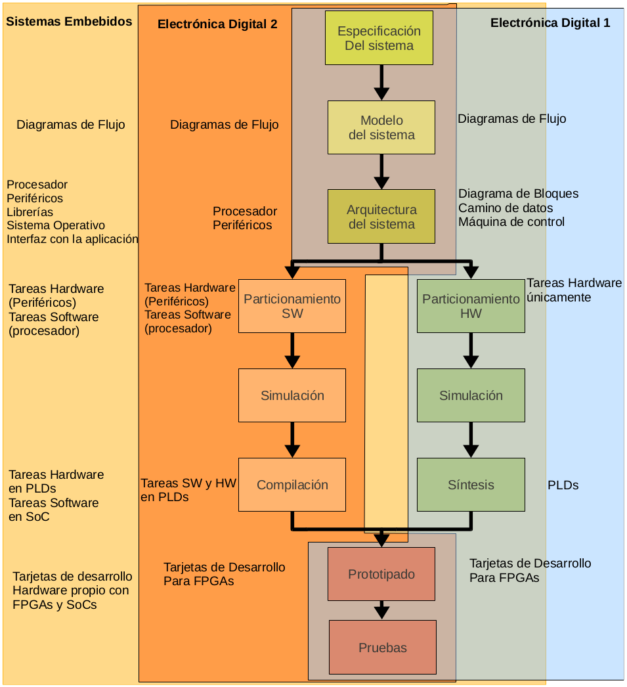

# Electrónica Digital

Este repositorio está orientado al diseño de sistemas digitales complejos
principalmente con herramientas *Open Source*, por tanto, requiere de una
distribución *GNU/Linux* para instalar las herramientas y probar los ejemplos.

A continuación se presenta un menú de enlaces que son de utilidad para
navegar por el contenido:

* Instalación de herramientas:
    * [Instalación de GNU/Linux](./installTools/how-install-linux.md)
    * [Instalación de herramientas open source de simulación, síntesis y configuración de sistemas digitales](./installTools/README.md)
    * [Instalación de Quartus (Solo para síntesis en FPGA Cyclone IV)](./installTools/quartus.md)
    * Instalación de instrumentos:
        * [Instalación de analizador lógico](./installTools/instruments/logic-analizer-24MHz-8CH/)
        * [Instalación de osciloscopio owon en Linux](./installTools/instruments/oscilloscope-owon/)
    * Otras herramientas:
        * Geany editor de texto: [Instalación y configuración de Geany](./installTools/geany.md)
* Laboratorios:
    * [Laboratorio de comparación de tecnologías CMOS vs TTL](./labs/lab-tec/)
    * [Laboratorio de simulación de sistemas digitales con herramientas open source](./labs/lab01/)
* Simulación de sistemas digitales:
    * Digital:
        * [Simulación de un sumador completo](./simulations/digital/digital_sim_fullAdder/)
    * IVerilog:
        * [Simulación de un sumador completo](./simulations/iverilog/fullAdder/)
* Recursos para FPGA:
    * [Colorlight](./fpga-example/colorlight-5a-75e/)
    * [BlackIce](./fpga-example/ice40-hx4k-MyStorm-BlackIce-Mx/)
    * [Cyclone IV](./fpga-example/altera-c4e6e10/)
    * [openep4ce6-c](./fpga-example/openep4ce6-c/)
* Libros y notas:
    * [Documentación sobre herramientas de diseño y uso de FPGAs de manera general](./resources/)
    * [Notas de electrónica digital, Johnny Cubides](https://codeberg.org/johnnycubides/digital-electronics-i-book/releases/download/v0.1/book.pdf)

El diseño de sistemas digitales contiene diferentes fases como se describe aquí: (diagrama de diseño de flujo digital)

Regards,

Johnny
