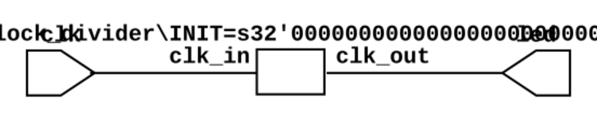

# Blink en FPGA Altera Cyclone IV

Se trata del parpadeo del LED cada segundo (a 1 Hz), hay que
tener presente la frecuencia del cristal oscilador de esta FPGA
la cual está a 50 Mhz, por tanto se requiere un divisor de frecuencia.

## Diagrama RTL

**RTL top**



**RTL Divider**


##  CONFIGURACIÓN DE PROYECTO

En principio, la siguiente información debe estar en el fichero `top.qsf`, en el 
caso de no encontrarse allí deberá abrir el archivo y agregarla.

```bash
set_global_assignment -name FAMILY "Cyclone IV E"
set_global_assignment -name DEVICE EP4CE10E22C8
set_global_assignment -name TOP_LEVEL_ENTITY top
set_global_assignment -name PROJECT_OUTPUT_DIRECTORY build

## ASIGNACIÓN DE PINES ##
set_location_assignment PIN_23 -to clk
set_location_assignment PIN_74 -to led
```

## ¿Cómo ejecutar el ejemplo?

1. Deberá tener las herramientas de desarrollo instaladas en su equipo.
    * [¿Cómo instalar Quartus?](https://github.com/johnnycubides/digital-electronic-1-101/blob/main/installTools/quartus.md)
    * [Herramientas de simulación y síntesis con *Conda*](https://github.com/johnnycubides/digital-electronic-1-101/blob/main/installTools/conda-and-tools.md)

2. Descargue el proyecto [blink.zip](./blink.zip) y descomprima en un directorio de trabajo.

3. Verifique el archivo de configuración denominado `top.qsf` con la configuración propuesta
en la descripción mencionada arriba o aquella que encuentra en el archivo `./config.txt`.

4. Es importante que en el archivo `Makefile` dentro de prj configure la ruta de la herramienta
QUARTUS, esta ruta deberá coincidir con la ruta donde haya instalado QUARTUS, ejemplo:

```bash
# # Ruta donde está quartus instalado
PATH_QUARTUS=~/gitPackages/quartus/quartus/bin
```

5. Para simular y ver los resultados ejecute,

```bash
make sim
```

6. Para sintetizar el proyecto ejecute el siguiente comando:

```bash
make syn
```
> **Atención**: si el comando `make syn` falla deberá verificar de nuevo el paso **3** y el paso **4.**

7. Para configurar la FPGA (con la FPGA conectada al programador) ejecute:

```bash
make config
```

8. Si quiere obtener el RTL del proyecto y verlo en una imagen SVG ejecute el siguiente comando:

```bash
make rtl
```

> Para obtener los comandos de ayuda escriba en la consola: `make help`

## Referencias

* [Ejemplo de divisor de frecuencia](https://www.fpga4student.com/2017/08/verilog-code-for-clock-divider-on-fpga.html)
* [Manejo en el timescale-verilog](https://www.chipverify.com/verilog/verilog-timescale)
