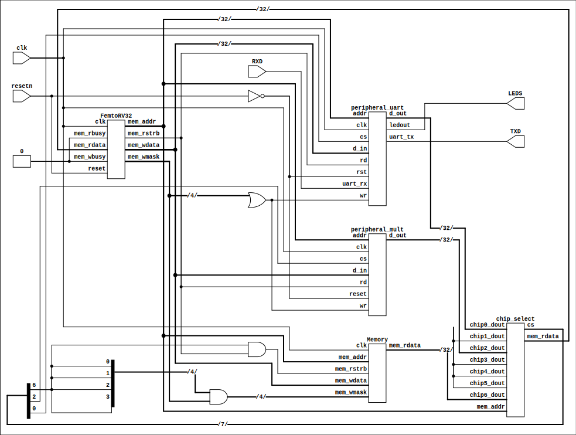
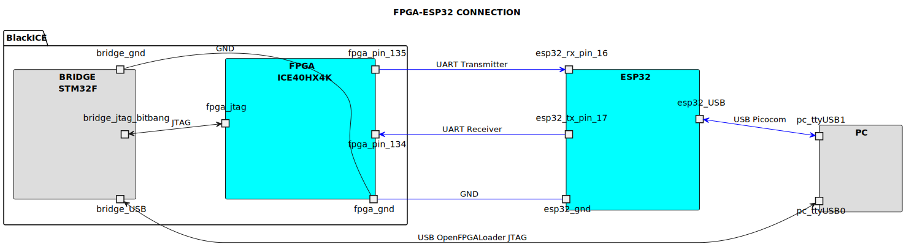
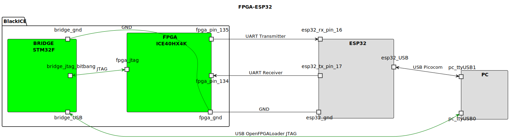

<!-- LTeX: enabled=true language=es -->
<!-- :set spell! -->
<!-- :MarkdownPreview -->
<!-- :GenTocMarked -->

# SoC FemtoRiscv32i



A continuación se presenta el diseño y configuración de un SoC basado en el FemtoRiscv32i (RV32I), como se muestra en la imagen superior.  
Este diseño es el resultado de diversas experiencias en la enseñanza del diseño de sistemas digitales, orientadas por el profesor Carlos Camargo de la Universidad Nacional de Colombia, las cuales he documentado y adaptado con fines pedagógicos.

Este SoC incorpora un procesador RV32I con el conjunto de instrucciones base, una memoria RAM para la carga de instrucciones y la ejecución del programa, un decodificador de direcciones (*address decoder*) y un *chip select* para gestionar el flujo de información entre los distintos periféricos.  
En este ejemplo, los periféricos implementados son:  
- Una UART para la comunicación entre el CPU y el exterior,  
- y un periférico de multiplicación por hardware, que sirve como punto de partida para el diseño de otros periféricos específicos según la aplicación.

El flujo de diseño, tanto de hardware como de software, es completamente *opensource*/*openhardware*, haciendo uso de herramientas como **Yosys**, **Nextpnr**, **Netlistsvg**, el compilador **GCC**, entre otras.

A grandes rasgos, el flujo de diseño consta de tres pasos:

1. Compilación de las tareas de software para el RV32I en lenguaje **C** ([./firmware/c-code/](./firmware/c-code/)) o en **ASM** ([./firmware/asm/](./firmware/asm/)), utilizando el *toolchain* de GCC para RISC-V.
2. Síntesis del SoC desde el `Makefile` (`./Makefile`) ubicado en este directorio, empleando herramientas como **Yosys** y **Nextpnr**.
3. Configuración del diseño en la FPGA.

> **A tener en cuenta**: Para poder replicar este ejemplo, por favor descarga el archivo [femtoriscv.zip](./femtoriscv.zip).

## Implementación SoC en FPGA y ESP32 como interfaz de comunicación


Para que el soc tenga una capacidad mayor de integración, en este ejemplo se
integra un microcontrolador **ESP32** que puede servir para 3 propósitos específicos:

- Ser un bridge entre la UART de la FPGA y una comunicación serial, que permita la
comunicación guida con otros sistemas como por ejemplo un PC.
- Ser un bridge entre la UART y una comunicación no guiada (WiFi) o Bluetooth, de
tal manera que el SoC puede ser parte de una solución en red y que pueda
exponer servicios consumibles en red.
- Si la FPGA no cuenta con un periférico ADC, se puede aprovechar el
periférico ADC del ESP32 y devolver los datos de conversión al SoC para los
propósitos de procesamiento.

## Configurar el ESP32 como bridge UART



Se requiere ahora cablear el esp32 a la FPGA. Para este propósito, deberá
prestar especial atención al diagrama de arriba donde se señalan los elementos
a cablear con color azul. Observe además que cada puerto de cada componente
tiene señalado el número de pin a usar para ello vísite la información
relacionada al pinout tanto de la FPGA como del esp32 a usar.

Seguido podrá realizar el proceso de flashing del esp32 como de la ejecución del programa
de ejemplo corriendo en el SoC.

1. Instalar las dependencias de flashing del esp32. Para ello, ejecute estos pasos:

```bash
sudo apt install picocom g++
conda activate digital # Active la variable de entorno de digital
pip install click esptool pyyaml adafruit-ampy
```

> **Observación**: en el caso de no ser compatible la variable de entorno
> **generando error**, podría crear una nueva variable de entorno con conda que
> soporte los paquetes a instalar, por ejemplo: (Ver Details)

<details>

```bash
# Ejecutar estos pasos solo si los pasos anteriores del punto 1. fallaron
conda create --name esp32
conda activate esp32
pip install click esptool pyyaml adafruit-ampy
```
> Tenga presente que para desactivar el entorno basta con `conda deactivate`.
</details>

2. Desde la [página oficial de descargas de Micropython para el
   ESP32](https://micropython.org/download/ESP32_GENERIC/) descargue la útima
versión de micropython disponibles para el esp32, en este caso se trata de la
versión
[v1.25.0(2025-4-15).bin](https://micropython.org/resources/firmware/ESP32_GENERIC-20250415-v1.25.0.bin),
para tal finalidad puede ejecutar el siguiente comando:

```bash
wget -O micropython-esp32.bin "https://micropython.org/resources/firmware/ESP32_GENERIC-20250415-v1.25.0.bin"
```

3. Instale micropython en el esp32. Para ello solo deje conectado el esp32 en
   los puertos USB del PC así logrará que el instalador detecte automáticamente
el bridge del esp32 para su flashing. Ejecute los siguientes comandos:

```bash
# Recuerde tener activa la variable de entorno donde tienen instalada las librerías de python
esptool.py erase_flash
esptool.py --baud 460800 write_flash 0x1000 micropython-esp32.bin
```

Resultado:

<details>

```bash
esptool.py v4.7.0
Found 6 serial ports
Serial port /dev/ttyUSB0
Connecting......................................
/dev/ttyUSB1 failed to connect: Failed to connect to Espressif device: No serial data received.
For troubleshooting steps visit: https://docs.espressif.com/projects/esptool/en/latest/troubleshooting.html
Serial port /dev/ttyUSB1
Connecting....
Detecting chip type... Unsupported detection protocol, switching and trying again...
Connecting.....
Detecting chip type... ESP32
Chip is ESP32-D0WDQ6 (revision v1.0)
Features: WiFi, BT, Dual Core, 240MHz, VRef calibration in efuse, Coding Scheme None
Crystal is 40MHz
MAC: a4:cf:12:74:fd:e4
Uploading stub...
Running stub...
Stub running...
Erasing flash (this may take a while)...
Chip erase completed successfully in 7.6s
Hard resetting via RTS pin...
```

>  **Observación**: En el caso de que no haga flashing, oprima el botón de BOOT en el esp32:

</details>


4. Abra una terminal e interactúe con Micropython el cual usa una sintaxis de Python3. Para ello, ejecute los siguientes comandos:

```bash
# Verifique el archivo representativo del puerto serial del esp32, es probable que sea /dev/ttyUSB0
picocom /dev/ttyUSB0 -b 115200 # Dependiendo del archivo representativo el tty puede cambiar
```

Resultado:

<details>

  ```py
picocom /dev/ttyUSB0 -b 115200
picocom v3.1

port is        : /dev/ttyUSB0
flowcontrol    : none
baudrate is    : 115200
parity is      : none
databits are   : 8
stopbits are   : 1
escape is      : C-a
local echo is  : no
noinit is      : no
noreset is     : no
hangup is      : no
nolock is      : no
send_cmd is    : sz -vv
receive_cmd is : rz -vv -E
imap is        : 
omap is        : 
emap is        : crcrlf,delbs,
logfile is     : none
initstring     : none
exit_after is  : not set
exit is        : no

Type [C-a] [C-h] to see available commands
Terminal ready

>>> print("hello")
hello
>>> 
```

</details>

Para salir de `picocom`, ejecute la secuencia **CTRL+a** y luego **CTRL+x**.

5. Cargue un script de Micropython en el esp32 para realizar el puente entre la FPGA y el esp32.
Para tal finalidad, cree un archivo `main.py` (también lo puede encontrar en [./docs/main.py](./docs/main.py)) y agregue el siguiente contenido:

```py
from machine import UART
from time import sleep

uart_fpga = None
uart_usb = None

def init():
    global uart_usb
    global uart_fpga
    # UART0: ahora libre
    uart_usb = UART(1, baudrate=115200, tx=1, rx=3)
    # UART2: FPGA
    uart_fpga = UART(2, baudrate=57600, tx=17, rx=16)

def bridge_uart():
    while True:
        if uart_fpga.any():
            uart_usb.write(uart_fpga.read())
        if uart_usb.any():
            uart_fpga.write(uart_usb.read())
        sleep(0.001)

def start():
    init()
    bridge_uart()

```

A continuación suba el script `main.py` al esp32. Para ello ejecuta el siguiente comando:

```bash
ampy -p /dev/ttyUSB0 -b 115200 put main.py
```

### Síntesis y configuración del SoC en la FPGA



Como puede apreciar en la imagen de arriba, los componentes responsables de la
configuración del SoC en la FPGA (en color verde) se encuentran conectados.
Para el proceso de configuración requiere tener instaladas las herramientas de
diseño que encontrará en el
[README.md](https://github.com/johnnycubides/digital-electronic-1-101/tree/main)
de este repositorio. Si aún no ha realizado el proceso de configuración de un
proyecto para esta FPGA, visita el siguiente enlace:

[Configuración volatíl y persistente para esta FPGA](https://github.com/johnnycubides/digital-electronic-1-101/tree/main/fpga-example/ice40-hx4k-MyStorm-BlackIce-Mx)

Seguido, deberá ejecutar los siguientes comandos para realizar el proceso de
implementación del SoC en la FPGA:

```bash
cd ./firmware/ && make firmware_words && cd .. # Generar tradutor bin a palabras. Solo se ejecuta una ÚNICA VEZ
make c-clean c-build # Creación ejecutable de riscv32i
make clean syn # Crear el bitstream para configurar la fpga
make config # Configurar fpga
```

Si la terminal entrega resultados sin errores podría continuar el siguiente paso.


### Prueba de funcionamiento

Inicie el script y arranque el programa en la FPGA. Para tal finalidad abra la terminal de picocom asociada al esp32, por ejemplo:

```bash
picocom /dev/ttyUSB0 -b 115200 # Dependiendo del archivo representativo el tty puede cambiar
```

Ahora para verificar el funcionamiento, en el prompt de micropython, ejecute la
instrución `start()` y luego, en la tarjeta de la FPGA, oprima el botón de
**RESET** (sino sabe cual es, deberá revisar el archivo de restricciones
físicas, archivo SOC.pcf), además, el objeto que representa el reset, lo puede
encontrar en el archivo [./docs/blackice-mx-pinout.png](./docs/blackice-mx-pinout.png). Después de
pulsar el reset, verá en la terminal un resultado similar al siguiente:

```py
>>> start() # Oprima reset en la FPGA
# Mostrará las diferentes operaciones de multiplicación
2x3=6
2x4=8
2x5=10
2x6=12
2x7=14
2x8=16
2x9=18
3x2=0
3x3=9
3x4=12
3x5=15
```

2025-06-18

Johnny Cubides
