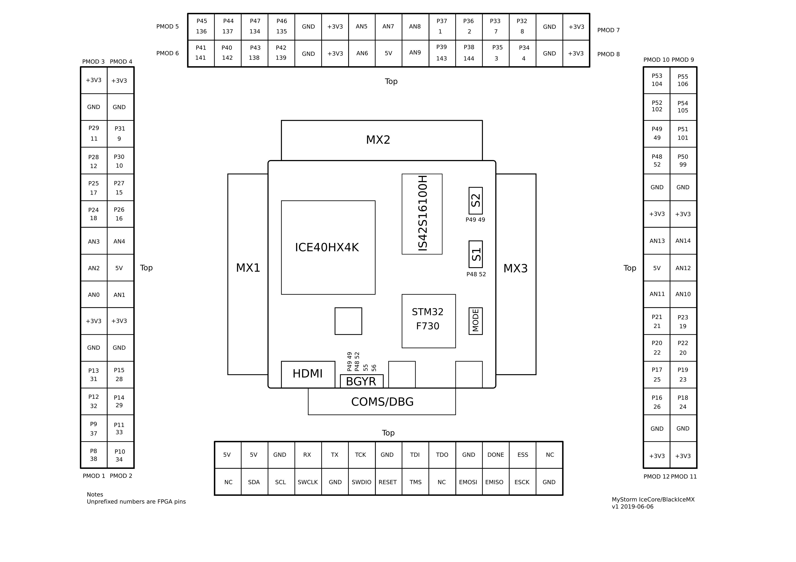

# Template para proyectos

Este archivo contiene una base de archivos fuentes para iniciar un proyecto para la placa de desarrollo Blackice2.

## ¿Cómo ejecutar el ejemplo?

1. Deberá tener las herramientas de desarrollo instaladas en su equipo.
    * Herramientas de simulación y síntesis con *Conda*

2. Descargue el archivo [template.zip](./template.zip) y desempaquete en un directorio de trabajo.

3. Para simular y ver los resultados ejecute:
```bash
make sim
```

4. Para sintetizar el proyecto ejecute el siguiente comando:
```bash
make syn
```

5. Para configurar la FPGA (con la FPGA conectada al programador) ejecute:
```bash
make config
```

6. Si quiere obtener el RTL del proyecto y verlo en una imagen SVG ejecute el siguiente comando:
```bash
make rtl
```

> Para obtener los comandos de ayuda escriba en la consola: `make help`

## Pinout de la Blackice2

 

Saludos,

Johnny
