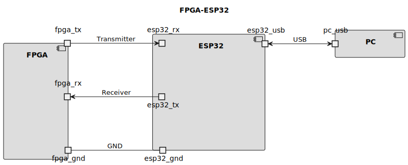

<!-- LTeX: enabled=true language=es -->
<!-- :set spell! -->
<!-- :MarkdownPreview -->
<!-- :GenTocMarked -->

# SoC FemtoRiscv32i


SoC basado en un riscv de instrucciones base (32 bits instrucciones integer)

Este proyecto está dividido en dosrk procesos:

1. Creación de tareas de software en lenguaje **C** (`./firmware/c-code/`) o en **ASM** (`./firmware/asm/`).
2. Sintesis de SoC desde el Makefile (`./Makefile`) de este directorio.

## Cómo ejecutar el ejemplo

```bash
cd ./firmware/ && make firmware_words # Generar tradutor bin a palabras. Solo se ejecuta una ÚNICA VEZ
make c-clean c-build # Creación ejecutable de riscv32i
make clean syn # Crear el bitstream para configurar la fpga
make config # Configurar fpga
```
## Conectar FPGA a esp32




## ¿Cómo ejecutar el ejemplo?

1. Deberá tener las herramientas de desarrollo instaladas en su equipo.
    * Herramientas de simulación y síntesis con *Conda*

2. Descargue el proyecto [template.zip](./template.zip) y descomprima en un directorio de trabajo.

3. Para simular y ver los resultados ejecute:
```bash
make sim
```

4. Para sintetizar el proyecto ejecute el siguiente comando:
```bash
make syn
```

5. Para configurar la FPGA (con la FPGA conectada al programador) ejecute:
```bash
make config
```

6. Si quiere obtener el RTL del proyecto y verlo en una imagen SVG ejecute el siguiente comando:
```bash
make rtl
```

> Para obtener los comandos de ayuda escriba en la consola: `make help`
