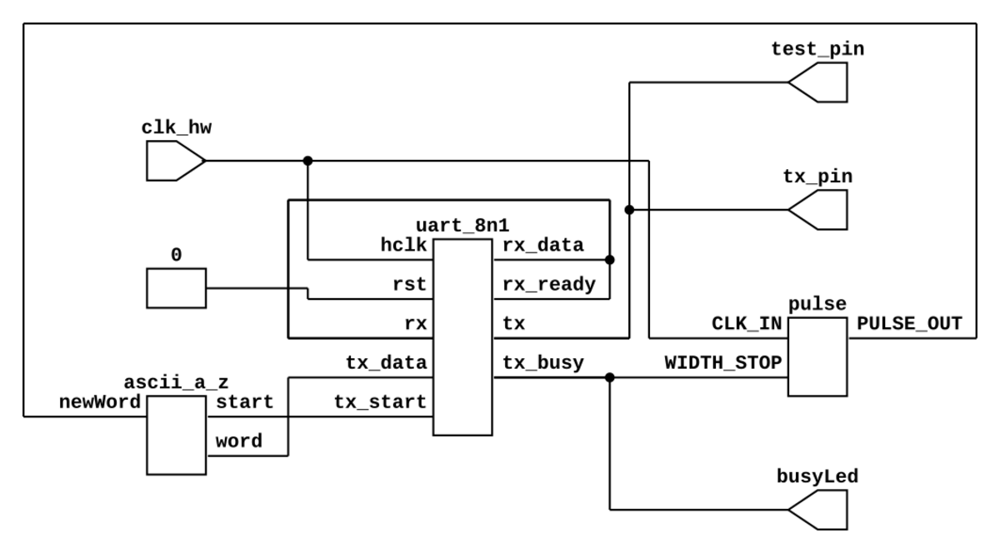

# Ejemplo de uso de periferico UART_TX

Se trata de un ejemplo sencillo sobre el uso de una comunicación serial
ampliamente usada en los dispositivos de electrónica digital. Este es un ejemplo
básico en el cual se requiere crear la señal en una frequencia que permita
la transimición de datos a una tasa de baudios determinada.



## ¿Cómo ejecutar el ejemplo?

1. Deberá tener las herramientas de desarrollo instaladas en su equipo.
    * Herramientas de simulación y síntesis con *Conda*

2. Descargue el proyecto [uar_tx.zip](./uart_tx_ej1.zip) y descomprima en un directorio de trabajo.

3. Para simular y ver los resultados ejecute:
```bash
make sim
```

4. Para sintetizar el proyecto ejecute el siguiente comando:
```bash
make syn
```

5. Para configurar la FPGA (con la FPGA conectada al programador) ejecute:
```bash
make config
```

6. Si quiere obtener el RTL del proyecto y verlo en una imagen SVG ejecute el siguiente comando:
```bash
make rtl
```

> Para obtener los comandos de ayuda escriba en la consola: `make help`

7. Para ver el resultado en consola:

```bash
picocom /dev/ttyUSB1 -b 9600
``` 

## Referencias

* ()[https://ece353.engr.wisc.edu/serial-interfaces/uart-basics/]
* ()[https://cpudev.org/wiki/UART]
* ()[https://www.analog.com/en/resources/analog-dialogue/articles/uart-a-hardware-communication-protocol.html]
