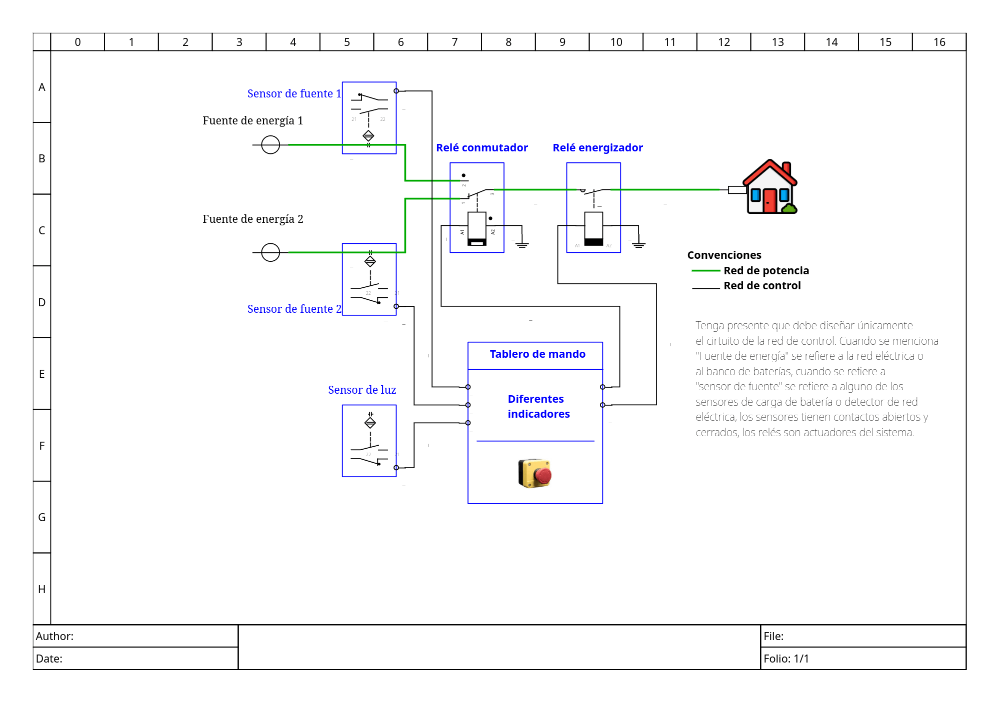

<!-- LTeX: language=es -->
# Mi primer diseño

<!--En esta actividad abordará el diseño de una solución de una situación problema,-->
<!--que puede ser abordada desde los conocimientos de circuitos que operan con lógica-->
<!--on/off por contacto y de lógica combinacional.-->
<!--El flujo de diseño planteado permitirá plantear una solución desde el dominio físico (circuito eléctrico),-->
<!--simular esta solución a través de una representación en lenguaje ladder, luego, pasar a un dominio estructural (red de compuertas lógicas), simular la red de compuertas,-->
<!--describir esta red de compuertas en un lenguaje HDL y verificar su funcionamiento nuevamente, para finalmente implementar esta solución en un dominio físico-->
<!--sintetizando la red decompuertas en una FPGA.-->
<!---->
<!--Observará además que una solución se puede abordar en diferentes dominios físicos o tecnologías.-->

En esta actividad, se abordará el diseño de una solución para una situación
problemática, comenzando con la propuesta de una representación del
comportamiento basada en las especificaciones del sistema y el algoritmo que lo
define. A partir de esta representación, se utilizarán conocimientos sobre
circuitos que operan con lógica de contacto on/off y lógica combinacional para
desarrollar el diseño.

El flujo de diseño propuesto incluirá las siguientes etapas:

* **Dominio comportamental (especificación y algoritmo)**: Se plantea inicialmente
el comportamiento del sistema, definiendo cómo debe operar según las
especificaciones. Esto incluye describir de manera abstracta las entradas,
salidas y relaciones lógicas mediante diagramas de flujo, tablas de verdad o
descripciones algorítmicas.
* **Dominio físico inicial (circuito eléctrico)**: Representa el sistema en
términos de componentes eléctricos básicos, como interruptores o relés, que
reflejan el concepto de lógica on/off. Este enfoque ayuda a conceptualizar la
solución desde un punto de vista tangible.
* **Simulación en lenguaje ladder**: Facilita la representación y simulación
del sistema en un entorno de control industrial, siendo una herramienta
ampliamente utilizada en automatización para validar el funcionamiento lógico
antes de pasar a etapas más abstractas.
* **Dominio estructural (red de compuertas lógicas)**: Permite abstraer el
problema hacia una descripción más universal, independiente de implementaciones
físicas específicas, facilitando el análisis y la optimización del diseño.
* **Descripción en lenguaje HDL (Hardware Description Language)**: En esta
etapa, se traduce la solución a un formato estándar para sistemas digitales
modernos, permitiendo realizar simulaciones avanzadas, verificaciones de
funcionamiento y preparativos para la síntesis en hardware.
* **Síntesis en FPGA (dominio físico final)**: Finalmente, la solución se
implementa en un hardware reconfigurable, regresando al dominio físico con
tecnologías avanzadas que permiten probar y utilizar el diseño en entornos
reales.

Durante cada etapa, se enfatizará la validación del diseño para garantizar que
las transiciones entre dominios mantengan la coherencia y funcionalidad de la
solución.

Además, se observará que una misma solución puede abordarse desde diferentes
dominios físicos o tecnologías, lo que refuerza la importancia de comprender
cómo los distintos enfoques impactan en la implementación final y en la
elección de herramientas o métodos adecuados.

## Situación a enfrentar (Enunciado en lenguaje informal)

<!--Usted tiene un familiar que vive en el campo, tiene una finca y posibilidades de adaptar fuentes de energía para el consumo-->
<!--energético de su casa. En el lugar cuenta con la red eléctrica del comercializador de la zona rural y una excelente radiación-->
<!--solar. él sabe que usted está estudiando una ingeniería relacionada a la electricidad y le indica que está aburrido de los-->
<!--cortes de energía eléctrica en su zona. Usted por ocurrencia le sugiere tener un banco de baterías y un sistema fotovoltaíco para-->
<!--poder suplir de energía a su hogar cuando tenga fallos en la red eléctrica. A su familiar le suena la idea y como dicen coloquialmente-->
<!--¡lo embala!, llama a los demás familiares y empieza a expresar que usted se ha comprometido a desarrollar y diseñar-->
<!--ese sistema. usted por lo tanto siente que debe hacer lo mejor para que en Navidad sus familiares le feliciten porque está aplicando-->
<!--los conocimientos que ha estado desarrollando en su carrera.-->
<!---->
<!--Después de realizar las mediciones pertinentes de la carga eléctrica del hogar usted adquiere un sistema foltovoltáico, banco de baterías e iversores-->
<!--para acodicionar la red eléctrica de la casa y tiene los siguientes materiales:-->
<!---->
<!--* Un relé para conmutar la red del inversor y la red eléctrica del comercializador de la zona.-->
<!--* Un relé para energizar o desenergizar la red interna de la casa, en el caso de requerir realizar algún mantenimiento-->
<!--* Un sensor de medición de carga de la bateria, el cual sensa cuando la batería está cargada y cuando está descargada, tiene contactos tanto normalmente abiertos como normalmente cerrados.-->
<!--* Un sensor de luz que puede ser usado para detectar cuando hay radiación solar, tiene contactos tanto abiertos como cerrados-->
<!--* Un sensor detector de energía de red, el cual indica cuando hay electricidad en la red y cuando no la hay, tiene contactos abiertos y cerrados-->
<!--* Un tablero de mando en el cual usted puede poner diferentes indicadores, como pueden ser, paro de emergencia, batería descargada, detector de red electrica, casa energizada, etc.-->
<!--* Un botón de paro de emergencia o  demantenimiento, el cual, como fue mencionado, puede desenergizar su casa y para realizar otros mantenimientos.-->
<!---->
<!--El sistema que usted diseña minimo debe ser capaz de:-->
<!---->
<!--* Conmutar las fuentes de energía, ya sea de las baterías (el inversor) o de la red eléctrica.-->
<!--* Indicar cuando están las baterías descargadas-->
<!--* Indicar si se encuentra energizada la casa-->
<!--* Indicar si se detecta la red eléctrica de la casa-->
<!--* Indicar si hay suficiente radiación solar-->
<!--* Desde el tablero de mando poder detener el sistema desenergizado la casa.-->
<!---->
<!--Podrá realizar las combinaciones que usted crea convenientes, recuerde que ante su familia, usted es el que sabe, buena suerte!-->

Tienes un familiar que vive en el campo, en una finca, y tiene la posibilidad
de adaptar fuentes de energía para suplir el consumo eléctrico de su hogar. En
la zona donde vive, cuenta con la red eléctrica del comercializador local, pero
también dispone de una excelente radiación solar. Este familiar, sabiendo que
estás estudiando una ingeniería relacionada con la electricidad, te comenta que
está cansado de los constantes cortes de energía.

Con base en esto, se te ocurre sugerirle que implemente un sistema de energía
renovable que consta de un banco de baterías, el cual se recarga por energía
solar, así, garantizar el suministro de energía cuando haya fallos en la red
eléctrica. A tu familiar le entusiasma la idea (¡te embala, como se dice
coloquialmente!) y no tarda en contárselo al resto de la familia, expresando
que te has comprometido a diseñar y desarrollar dicho sistema. Ante esta
situación, decides tomar el reto en serio, pensando que sería genial recibir
felicitaciones de todos en Navidad por aplicar los conocimientos adquiridos en
tu carrera.

Después de realizar las mediciones pertinentes del consumo eléctrico de la
casa, adquieres un sistema fotovoltaico, un banco de baterías e inversores para
acondicionar la red eléctrica del hogar. Además, cuentas con los siguientes
materiales:

1. **Un relé o contactor** para conmutar entre la red del inversor y la red eléctrica del
   comercializador.
2. **Un relé o contactor** para energizar o desenergizar la red interna de la casa en caso de
   requerir mantenimiento.
3. **Un sensor de carga de batería**, que detecta cuando la batería está cargada o
   descargada; incluye contactos normalmente abiertos y cerrados.
4. **Un sensor de luz**, que detecta la radiación solar; incluye contactos
   normalmente abiertos y cerrados.
5. **Un sensor detector de red eléctrica**, que indica si hay o no suministro en la
   red eléctrica; incluye contactos abiertos y cerrados.
6. **Un tablero de mando**, donde puedes instalar diversos indicadores, como: paro
   de emergencia, batería descargada, detector de red eléctrica, casa
energizada, entre otros.
7. **Un botón de paro de emergencia o mantenimiento**, que permite desenergizar la
   casa para realizar intervenciones de forma segura.

El sistema que diseñes debe ser, como mínimo, capaz de:

1. Conmutar entre las fuentes de energía: el banco de baterías (inversor) y la
   red eléctrica.
2. Permitir detener el sistema y desenergizar la casa desde el tablero de
   mando.

Se sugiere que tengas en cuenta estas posibilidades en su comportamiento:

* Indicar cuando las baterías están descargadas.
* Indicar si la casa está energizada.
* Indicar si la red eléctrica está disponible.
* Indicar si hay suficiente radiación solar.

Puedes combinar los elementos disponibles de la manera que consideres más
adecuada para cumplir con los requisitos. Recuerda que, ante tu familia, tú
eres quien sabe. ¡Buena suerte!

### Ayudas

* En esta [imagen](./qelectrotech/diagrama-lab2.pdf) puede observar el diagrama
que representa la situación a enfrentar, recuerde que debe diseñar únicamente
la red de control:

* Tenga presente la información que encuentra
[aquí](./qelectrotech/contactos-conmutador-bateria-y-fuente.pdf) sobre el
conmutador, contactos y reles, le será útil para su diseño.
* En [este PDF](./notas_annotated.pdf) está la información relacionada a pasar del dominio físico al estructural de
este ejemplo.
* No olvide hacer uso del [ejemplo](./example-design_annotated.pdf) de diseño que fue compartido en Discord.

## Desarrollo

Teniendo presente el flujo de diseño y las etapas, deberás realizar los siguientes pasos:

1. **Dominio comportamental (especificación y algoritmo)**:

* Proponer un sistema representado en un diagrama de caja negra.
* Plantear la tabla de verdad que describe el comportamiento.
* Representar el algoritmo de la solución a través de un diagrama de flujo.

Observaciones: Recuerde que **usted es libre de diseñar su sistema** teniendo presente su propia lógica, puede hacer indicaciones de aquellas cosas que puedan generar error o estados no deseados.

2. **Dominio físico inicial (circuito eléctrico)**:

* Diseñar un circuito eléctrico del sistema de control con sus contactos de entrada y actuadores de salida.
* Describir el circuito a través del lenguaje ladder

Observación: haga indicaciones de aquellas cosas que pudo haber asumido.

3. **Simulación en lenguaje ladder**:

* Haga uso del programa [plcsimulator: simulador de plc lenguaje ladder](https://app.plcsimulator.online/) y verifique
que cumpla con los requerimientos del dominio comportamental.

Observación: Deje comentarios en sus simulaciones en el caso de requerir realizar aclaraciones.

4. **Dominio estructural (red de compuertas lógicas)**:

* Convierta su diagrama de lenguaje ladder a la red de compuertas lógicas que lo representa
* Haga la red de compuertas lógicas en el software de [Digital](https://github.com/hneemann/Digital)
* comparta tanto los diagramas, tablas de verdad (verifique), simulaciones, mapas de karnaugh, representación del circuito con compuertas universales, LUT y suma de productos.

5. **Descripción en lenguaje HDL (Hardware Description Language)**:

* Desde Digital exporte a verilog y guarde en un archivo top.v
* Identifique los puertos, el nombre del módulo creado y relaciónelo con el diagrama de caja negra del dominio comportamental.
* Identifique los operadores que representan las compuertas lógicas.

6. **Síntesis en FPGA (dominio físico final)**:

* En este punto, sintetice el diseño que está descrito en HDL en el archivo
top.v en una FPGA, dependiendo de la FPGA siga el flujo de diseño para la
configuración de la misma, recuerde los pines a seleccionar y las restricciones
físicas.
* Plantee un circuito que se conecte a la FPGA que emule el comportamiento de
los diferentes sensores y actuadores del problema.

7. **Socialización del resultado**:

* Cree un repositorio git donde comparta las experiencias de estos
laboratorios, en específico, crear un directorio con el nombre o número del
laboratorio, por ejemplo, lab2. Allí comparta un README con el procedimiento
indicado en **Desarrollo** junto a las imágenes y archivos fuentes (verilog,
archivos .dig, Makefiles, archivos de restricciones físicas, etc), haga
uso de Markdown para agregar las imágenes al texto, enlaces, entre otros.
* Cree un vídeo de máximo 5 minutos en Youtube, comparta el enlace en el
README.md
* Exponga frente a sus compañeros su experiencia de diseño.

## Referencias

* [plcsimulator: simulador de plc lenguaje ladder](https://app.plcsimulator.online/)
* [QElectroTech: Creador de diagramas industriales electricos complejos](https://qelectrotech.org/)
* [¿Cómo se configura el ejemplo del laboratorio 2 en la FPGA BlackICE?](https://www.youtube.com/watch?v=2GnsQ3oH4YA)
* [¿Cómo se configura el ejemplo del laboratorio 2 en la FPGA Cyclone IV?](https://youtu.be/vO_olVPR1BQ)
