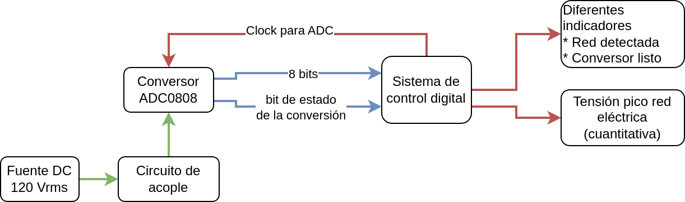

# Diseño de multimetro DC

 

## Desarrollo Top Down

1. Dominio comportamental

* Identifique los requerimientos funcionales y no funcionales del sistema a diseñar
* Idetifique las entradas y salidas de información con su tipo (analógicas y digitales)
* Realice el disgrama de flujo del comportamiento de su sistema a través de un diagrama de flujo o pseudo-código
* Puede hacer uso de otras herramientas (como tablas de verdad) para realizar las demás especificaciones del sistema

2. Dominio comportamental

* Realice un diagrama de caja negra de los diferentes módulos que requiere su sistema
* En el caso de que cada módulo contenga otros submódulos, identifique a través de diagramas de caja negra cómo están relacionados
* Realice el diseño de cada módulo a trvés de compuertas lógicas, decodificadores, multiplexores, entre otros.
* Desarrolle simulaciones en Digital
* Realice simulaciones en Iverilog

3. Dominio físico

* Monte el circuito requerido para realizar la implementación física
* Proponga un protocolo de ensayo-pruebas para garantizar que usted y la FPGA operarán en un entorno seguro
* Realice el proceso de síntesis y configuración de la FPGA
* Realice un vídeo en Youtube explicando este flujo de diseño, resultados y sus conclusiones
