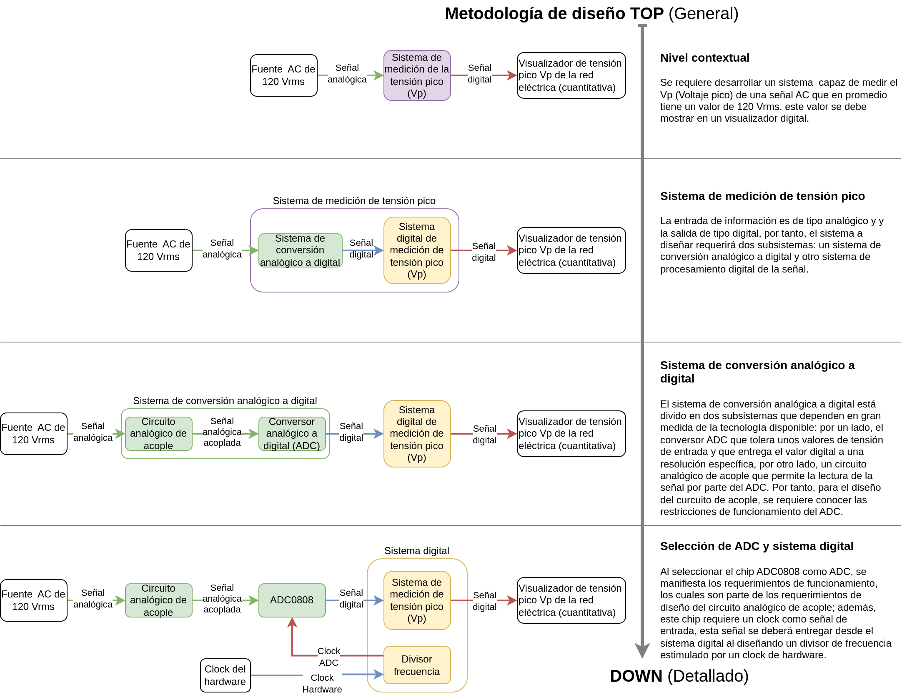

<!-- LTeX: language=es -->

# Diseño de un voltímetro de Vp (tensión pico) para una red monofásica de 120 Vrms

## 1. Planteamiento

Se requiere diseñar un voltímetro capaz de medir la tensión pico de una red de
corriente alterna monofásica, cuyo valor promedio es de 120 Vrms. Es importante
tener en cuenta que el valor pico de la tensión puede variar debido a factores
como el tipo de carga y la demanda de energía. Por esta razón, en algunos
casos, la tensión puede aproximarse a 110 Vrms, mientras que en otros puede
rondar los 120 Vrms.

En el siguiente diagrama se presenta una representación del diseño top-down, la
cual permite abordar el problema desde un nivel abstracto hasta llegar a los
detalles concretos. Cada módulo o sistema puede descomponerse en subsistemas
específicos, flujos de información y tipos de datos. En esta etapa, se
seleccionan tecnologías o métodos adecuados con base en los recursos
disponibles para satisfacer los requerimientos del diseño.

En el diagrama anterior ([puede descargar el diseño en pdf desde aquí
también](./voltimetro-nivel-conceptual.drawio.pdf)), se representa el sistema
dividido en varios subsistemas. Se identifica un subsistema de conversión
encargado de acondicionar la señal analógica para su medición digital, y un
sistema digital responsable del procesamiento de la información.

En el subsistema de conversión analógica a digital se plantea el uso del chip
**ADC0808**. Para diseñar el circuito analógico de acople, es necesario estudiar el
datasheet del chip y garantizar el cumplimiento de sus especificaciones.
Dependiendo de la tecnología utilizada en el circuito de acople, deben
considerarse posibles pérdidas en la señal y aplicar correcciones en el
procesamiento digital. Por ejemplo, si se emplean diodos, estos requieren una
tensión de conducción aproximada de $0.7 V$, la cual debe ser compensada durante
el procesamiento digital para minimizar el error.

El **ADC0808** tiene una resolución de conversión de **8 bits**, lo que permite
representar valores en un rango de **0 a 255 unidades**. Para simplificar el
diseño, se recomienda que el sistema de procesamiento digital pueda medir
valores en un rango de **0 Vp a 255 Vp**.

En cuanto a la visualización digital, se propone mostrar cuantitativamente el valor de la tensión pico. Esto puede lograrse mediante el uso de **3 displays de 7 segmentos** para representar unidades, decenas y centenas, o bien enviando los datos a una terminal serial en el computador mediante el protocolo **UART**.

## 2. Tenga en cuenta

### 2.1 Sobre el ADC0808

- Estudie el funcionamiento del **ADC por aproximaciones sucesivas**.
- Consulte en el **datasheet del ADC0808** las características de operación, el
diagrama de bloques, el esquema de conexión, entre otros detalles técnicos
relevantes.
- Verifique los **requerimientos de la señal de clock de entrada** para el ADC0808.

### 2.2 Sobre el circuito analógico de acople

Como se pudo observar en el diseño presentado anteriormente, es necesario
desarrollar el **circuito analógico de acople**. Por tanto:

- Diseñe el circuito analógico utilizando **elementos electrónicos
comerciales** (como diodos, transformadores, condensadores, etc.). El diseño
puede estar basado en un **rectificador de media onda o de onda completa**.
- Realice la **simulación correspondiente** para validar el funcionamiento del diseño.
- Considere las **pérdidas de tensión** ocasionadas por el funcionamiento del
circuito analógico. Estos valores podrán ser compensados posteriormente en el
**procesamiento digital** para ajustar los errores de medición.

### 2.3 Sistema digital

- Tenga en cuenta que para la **señal de clock del ADC0808** podría ser
necesario un **divisor de frecuencia**, el cual puede ser descrito en
**lenguaje HDL** y sintetizado en una **FPGA**.
- Los **módulos del sistema digital** pueden diseñarse utilizando elementos de
**lógica combinacional**, como **decodificadores**, **sumadores**,
**multiplexores**, entre otros.
- Los **errores originados por las pérdidas de tensión** en el circuito de
acople pueden ser compensados en el sistema digital, por ejemplo, mediante un
**sumador** que ajuste los valores medidos.

## 3. Desarrollo

A continuación se describe los pasos que deberá desarrollar en su proceso de
diseño. Deberá documentarlos en su correspondiente repositorio de git, dentro
de un directorio con su correspondiente README.md.

### 3.1 Dominio comportamental

* Identifique los requerimientos funcionales y no funcionales del sistema a diseñar.
* Identifique las entradas y salidas de información con su tipo (analógicas y digitales).
* Realice una representación del comportamiento de su sistema a través de un diagrama de flujo o pseudo-código.
* Puede hacer uso de otras herramientas (como tablas de verdad) para realizar las demás especificaciones del sistema.

### 3.2 Dominio estructural

* Realice un diagrama de caja negra de los diferentes módulos que requiere su sistema.
* En el caso de que cada módulo contenga otros submódulos, identifique a través de diagramas de caja negra cómo están relacionados.
* Realice el diseño de cada módulo a través de compuertas lógicas, decodificadores, multiplexores, entre otros.
* Describa su diseño digital en HDL.
* Desarrolle simulaciones en *Digital* de su diseño digital y verifique el comportamiento.
* Realice simulaciones en *Iverilog* de su diseño digital y verifique el comportamiento.

### 3.3 Dominio físico

* Monte el circuito requerido para realizar la implementación física.
* Proponga un protocolo de ensayo-pruebas para garantizar que usted y la FPGA operarán en un entorno seguro.
* Realice el proceso de síntesis de su diseño y configure la FPGA para realizar las pruebas del montaje del circuito.
* Realice un vídeo en Youtube explicando **este flujo de diseño, resultados y sus conclusiones (haga uso del material documental)**, el vídeo no debe superar los 5 minutos.
