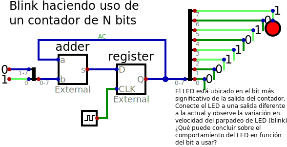

# Blink

**Descripción**: Simulación en *Digital* de un "Blink"; el cual consiste en hacer parpadear
un LED a través de un contador que se desborda al llegar al límite de conteo. El LED
es ubicado en la salida del registro tipo D en el bit más significativo. Dependiendo
de la frecuencia de la fuente de reloj de una FPGA, el contador debe ser creado 
con un ancho de bits mayor que el propuesto en este ejemplo (8 bits).

**Pasos para realizar esta simulación**:

1. Descarga el archivo [blink.zip](./blink.zip) y ubíquelo en un directorio de trabajo.
2. Ubique el terminar en ese directorio de trabajo y descomprima, ejemplo: `unzip blink.zip`
obtendrá tres archivos.
3. Active la variable de entorno digital de conda, `conda activate digital`.
4. Finalmente, en la terminal, ejecute digital llamando el archivo de simulación: `Digital.sh blink.dig`

**Observaciones**:
* Debe tener instalada las herramientas de digital en conda y la aplicación Digital.sh, esta información se encuentra en el repositorio https://github.com/johnnycubides/digital-electronic-1-101/

