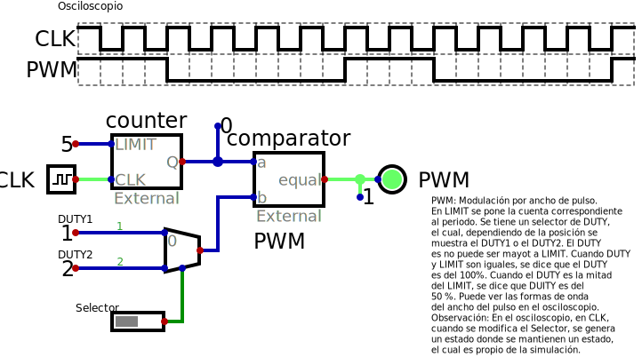

# PWM

**Descripción**: Simulación en *Digital* de un "PWM".

**Pasos para realizar esta simulación**:

1. Descarga el archivo [pwm.zip](./pwm.zip) y ubíquelo en un directorio de trabajo.
2. Ubique el terminar en ese directorio de trabajo y descomprima, ejemplo: `unzip pwm.zip`
obtendrá tres archivos.
3. Active la variable de entorno digital de conda, `conda activate digital`.
4. Finalmente, en la terminal, ejecute digital llamando el archivo de simulación: `Digital.sh pwm.dig`

**Observaciones**:
* Debe tener instalada las herramientas de digital en conda y la aplicación Digital.sh, esta información se encuentra en el repositorio https://github.com/johnnycubides/digital-electronic-1-101/

Johnny
