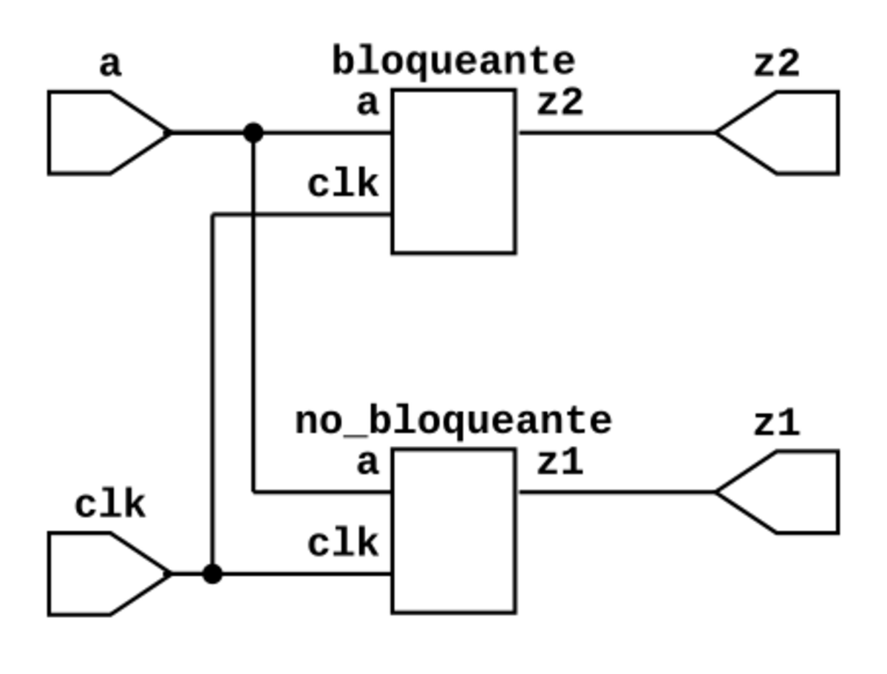
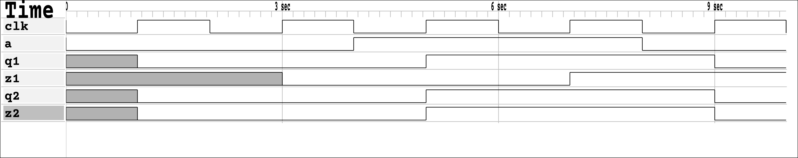
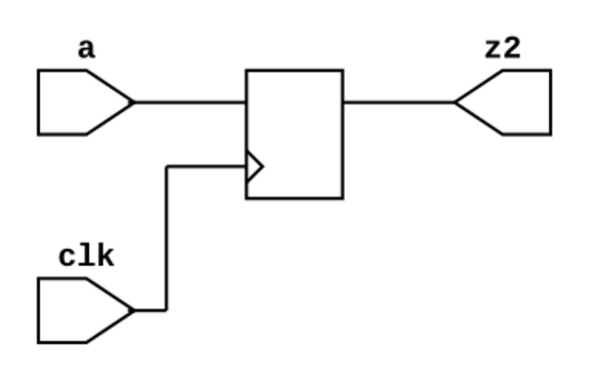

# Comparación de una asignación bloqueante y NO bloqueante

RTL de los dos bloques a comparar:



Formas de onda de las respuestas del circuito anteriormente representado:



RTL del módulo no bloqueante


RTL del módulo bloqueante



## Simulación a través de Makefile

Este proyecto contiene un `Makefile` que permite automatizar el proceso, para conocer
las diferentes opciones ejecute en la terminal el comando: `make help`

```bash
make sim        -> Simular diseño
make wave       -> Ver simulación en gtkwave
make rtl        -> Crear RTL
```

## Simulación manual

1. Descargar el archivo [assignament.zip](./assignament.zip) que contiene el proyecto y descomprimir en el área de trabajo.

2. Crear el ejecutable *top.vvp* con iverilog:

```bash
iverilog -o top.vvp top_tb.v
```

3. Iniciar la simulación generar resultados

```bash
vvp top.vvp
```
> Para finalizar simulación: `> finisih`

* Podría también realizar la simulación creando un archivo
`./file_list.txt` que contiene los módulos que intervienen en la simulación:

```bash
iverilog -o top.vvp -c file_list.txt
vvp top.vvp
```

Regards,

Johnny
