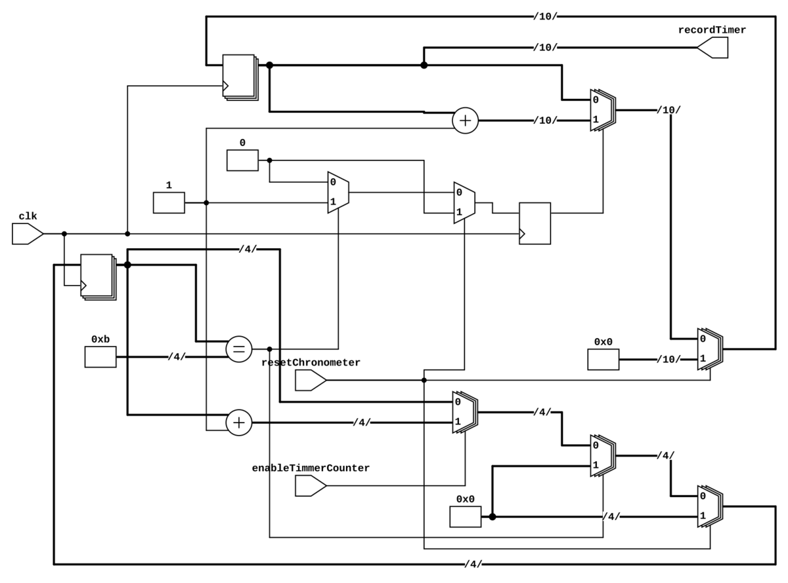

# Cronometro de milisegundo o usegundos

Este cronómetro tiene selector de ms y us, una señal 
de resetChronometer para reiniciar el recordTimer el
cual contienen el resultado del cronómetro y un enableTimmerCounter
responsable de habilitar el chronometro.




## Simulación a través de Makefile

Este proyecto contiene un `Makefile` que permite automatizar el proceso, para conocer
las diferentes opciones ejecute en la terminal el comando: `make help`

```bash
make sim        -> Simular diseño
make wave       -> Ver simulación en gtkwave
make rtl        -> Crear RTL

Regards,

Johnny
