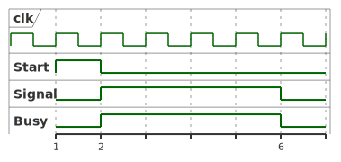
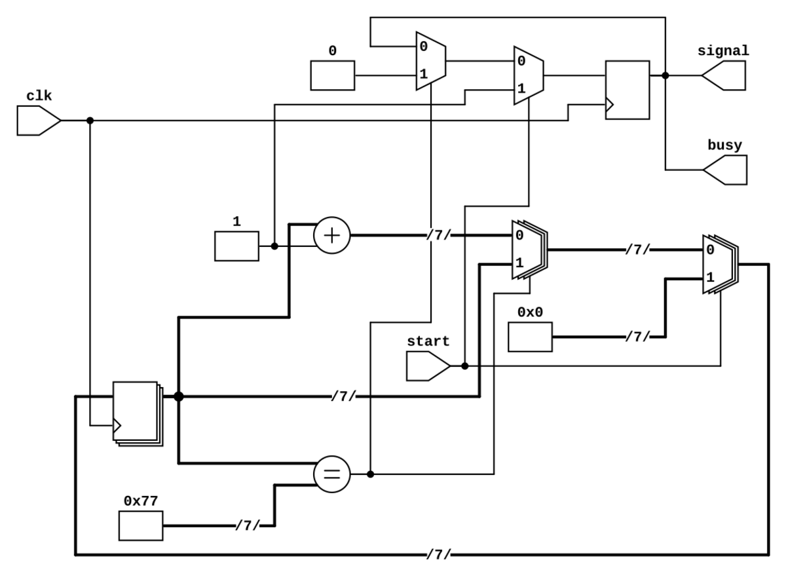

# Generador de único pulso


Este circuito genera un pulso de un tamaño determinado como parámetro.
Indicando el `FREQ_IN` en Hz y `WIDTH_PULSE` en Segundo en el proceso de presíntesis calcula el
tamaño de los recursos para generar el tamaño del pulso.

En el ejemplo, la frecuencia de entrada es de 12 Mhz y el ancho del pulso es de 10 uS.
Cada vez que se genera un START, el sistema genera el pulso en *signal* con el ancho
determinado.

Tenga presente que el ancho del pulso debe ser mayor al periodo de la frecuencia de entrada.

## Aplicaciones

Puede ser el trigger para un sensor ultrasonido, el start para la lectura de un sensor DHT11.

## Caja Negra

<details>

  @startuml pulse_width_bb
  [pulse_width] <-left- clk
  [pulse_width] <-left- start
  [pulse_width] -right-> signal
  [pulse_width] -right-> busy
  @enduml
</details>


<details>

@startuml pulse_timing
  clock "clk" as c0 with period 1
  binary "Start" as ST
  binary "Signal" as S0
  binary "Busy" as B0

  @1
  ST is high

  @2
  ST is low

  @2
  S0 is high
  B0 is high

  @6
  S0 is low
  B0 is low

@enduml
</details>

 



## Simulación a través de Makefile

Este proyecto contiene un `Makefile` que permite automatizar el proceso, para conocer
las diferentes opciones ejecute en la terminal el comando: `make help`

```bash
make sim        -> Simular diseño
make wave       -> Ver simulación en gtkwave
make rtl        -> Crear RTL
```

Regards,

Johnny

Generar svg:
```bash
plantuml -tsvg README.md
```
